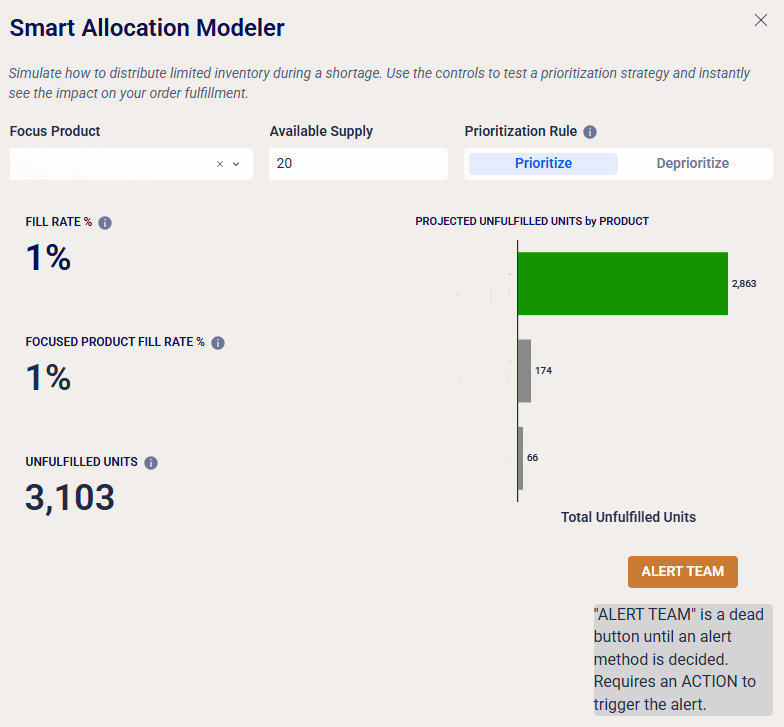

# Data Visualizations and Apps Portfolio
Portfolio of business intelligence dashboards and ad hoc analytics solutions using Sigma

## About Me
Principal Analytics Consultant with six years of experience building dashboards, data apps, and analytics solutions

## Experience
- phData (current) - Principal Analytics Consultant
- Softbank Robotics - Product Manager (Efficiency and Data Products) and Customer Experience Manager
- dwelo/Level Home - Data Analyst
- Former small business owner

## Connect
- LinkedIn: https://www.linkedin.com/in/carter-voekel/
- Workout Wednesday: https://workout-wednesday.com/author/cartervmac-com/
- Email: carterv@mac.com

## Projects

### 1. NPS Tool & Dashboard - Workout Wednesday
Interactive dashboard tool that calculates Net Promoter Score with a backend for trends and analysis
- **Tools:** Sigma (input tables, custom calcs, design, data apps, alerting)
- **[View Project](https://workout-wednesday.com/2025-week-30-sigma-do-you-nps-why-yes/)**

### 2. Custom Context Modal - Workout Wednesday
Right-click context menus that transform static cells into actionable insights, enabling external research and workflow triggers directly from the dashboard
- **Tools:** Sigma (input tables, actions, custom calcs, design, data apps)
- **[View Project](https://workout-wednesday.com/2025-week-26-sigma-context/)**

### 3. Sigma Notes App - Workout Wednesday
A Notion-like lightweight, no-code system for managing notes and reminders within Sigma
- **Tools:** Sigma (data apps, input tables, actions)
- **[View Project](https://workout-wednesday.com/2025-week-38-sigma-can-you-make-some-snotes/)**

### 4. Smart Allocation Modeler - Logistics & Planning
Simulate how to distribute limited inventory during a shortage. Use the controls to test a prioritization strategy and instantly see the impact on your order fulfillment
- **Tools:** Sigma (data apps, input tables, actions, control elements)
- 

  ### 5. Real-time Forecasting tools
Real-time forecasting in Sigma - no Excel, no imports, no waiting. Dynamic forecasting where your data already lives. Features: interactive growth models (linear, compound, actuals-based), live scenario planning (baseline, optimistic, pessimistic), and instant sensitivity analysis with adjustable inputs.
- **Tools:** Sigma (data apps, input tables, actions, control elements)
- [Download / view the demo video](WoWForecastvid.mp4) _Click 'view raw' to view the video_

## Skills & Tools
- **BI Tools:** Sigma, Looker, Power BI, Omni Analytics Platform 
- **Data Visualization:** Dashboard design, KPI development, data apps & solutions
- **Analytics:** Ad hoc analysis, data modeling, scenario modeling
- **Productivity:** JIRA, Asana, Salesforce, Hubspot, Miro, Trello, G Suite, MS Suite
- **AI:** ChatGPT (Projects, prompting), Claude, Gemini (NotebookLM)

## Workout Wednesday
- I'm a contributor to [Workout Wednesday Sigma Challenges](https://workout-wednesday.com/sigma-challenges/)

## Misc
- Foster Coordinator, [Dogs Matter](https://www.dogsmatter2.org/)
- Real estate investor
