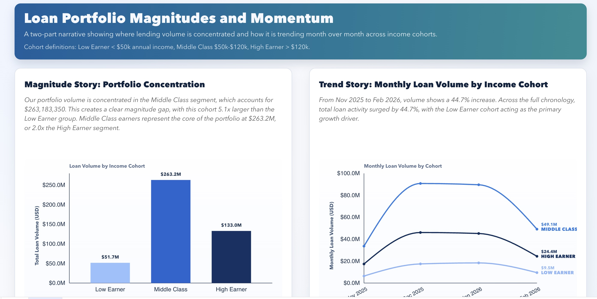
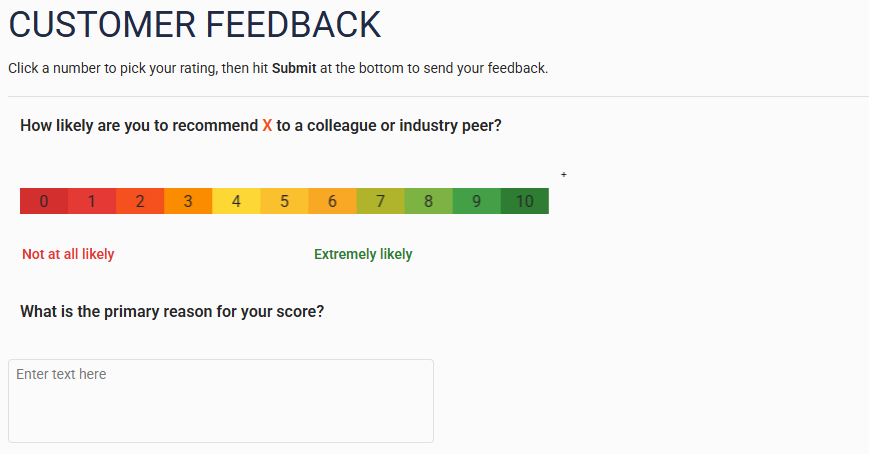
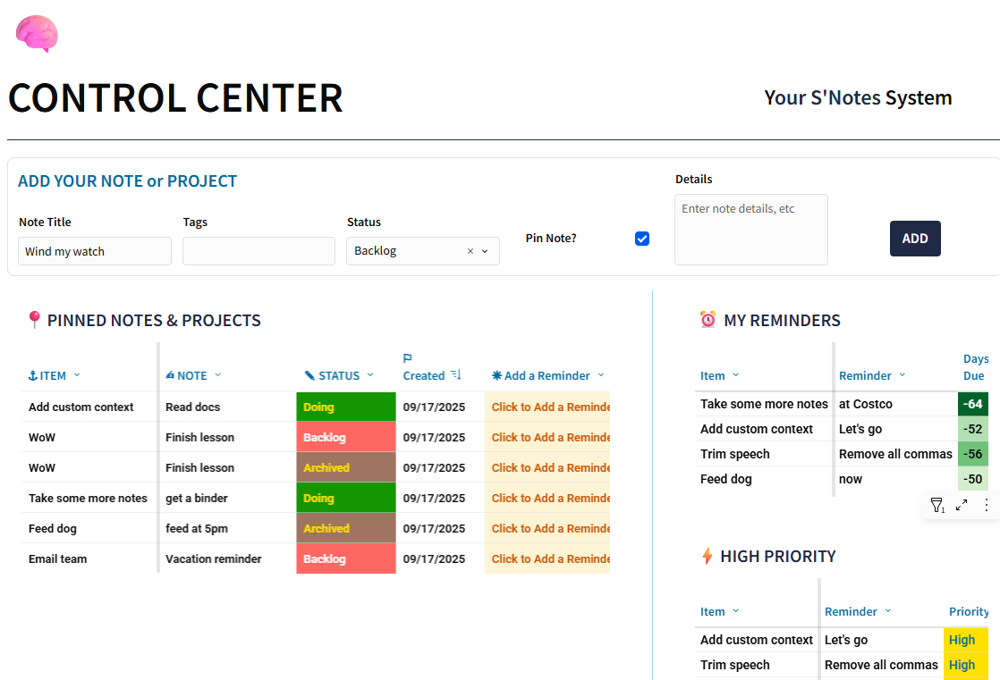
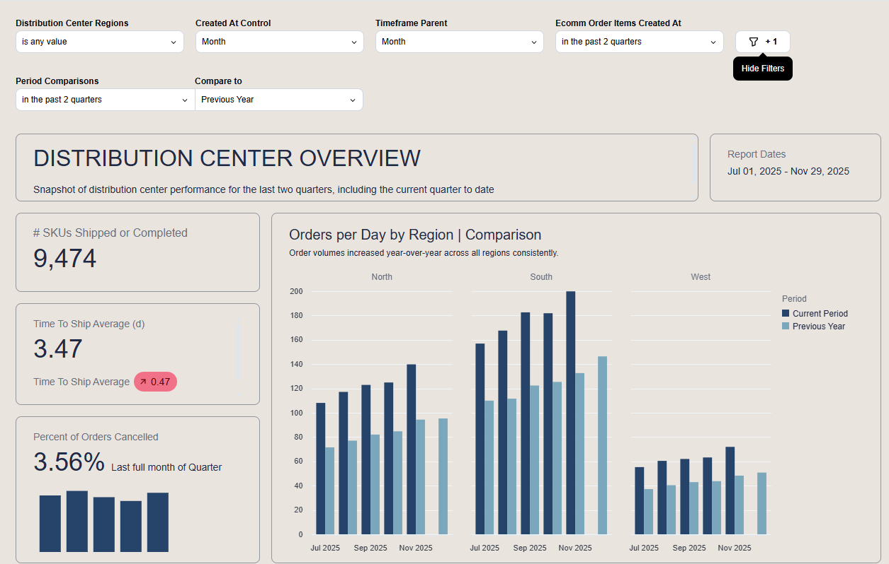
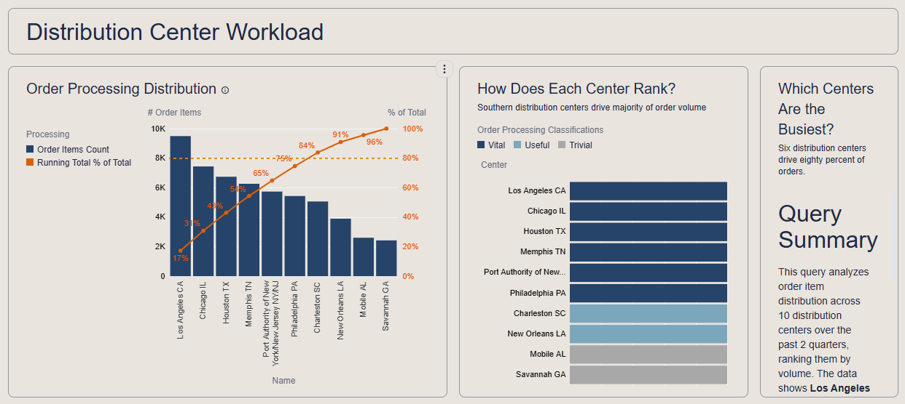
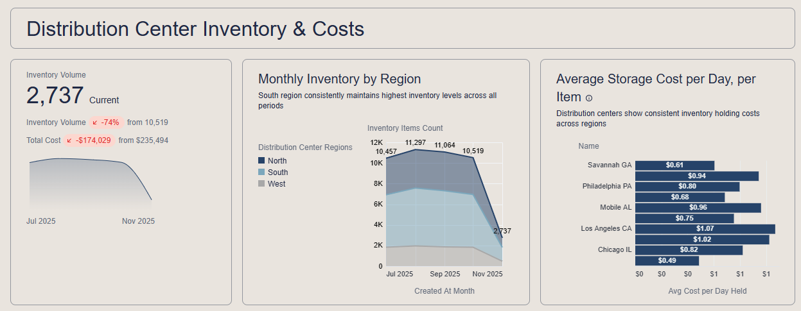
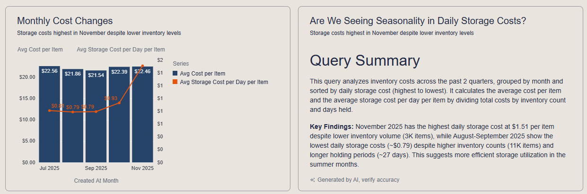

# Data Visualizations and Apps Portfolio
Business intelligence dashboards and data apps built in Sigma, focused on real-world operations, workflows, and customer analytics.

## How to explore
This portfolio highlights a few representative projects. Each section links to the live challenge or includes screenshots/video where possible.

## Projects at a glance
- [OmniBoss – AI Knowledge Assistant](#featured-projects)
- [NPS Tool & Dashboard](#1-nps-tool--dashboard---workout-wednesday)
- [Smart Allocation Modeler](#4-smart-allocation-modeler---logistics--planning)
- [Ruffy.dog – Consumer Safety Tool](#7-ruffydog--lightweight-consumer-data-app)

## About Me
Principal Analytics Consultant focused on building data products, dashboards, and data apps in modern BI tools (especially Sigma + Snowflake). I'm a contributor to [Workout Wednesday Sigma Challenges](https://workout-wednesday.com/author/cartervmac-com/)

## Development Approach

I use AI selectively to accelerate scaffolding, iteration, and documentation.  
All architectural decisions, data modeling choices, and scope trade-offs are made intentionally.

AI is treated as an assistant, not a substitute for judgment.

## Skills & Tools
- **BI:** Sigma, Omni, Tableau, Power BI
- **Analytics:** Data modeling, forecasting, scenario modeling
- **Stack:** SQL, Snowflake, modern data workflows
- **AI:** LLM-assisted development, retrieval-based agents, prompt design (ChatGPT, Claude, Gemini / NotebookLM)


## Experience
- phData (current) - Principal Analytics Consultant
- Softbank Robotics - Product Manager (Efficiency and Data Products) and Customer Experience Manager
- dwelo/Level Home - Data Analyst
- Former small business owner

## Connect
- LinkedIn: https://www.linkedin.com/in/carter-voekel/
- Workout Wednesday: https://workout-wednesday.com/author/cartervmac-com/
- Email: carterv@mac.com

---

## Featured Projects

### Sigma Workout Wednesday - AI-Assisted Plugin Storytelling (Numbers of Different Magnitudes)



Built for Sigma’s Workout Wednesday challenge, this project shows how AI-assisted vibe coding can extend Sigma beyond native visuals.  
I designed and implemented a custom React + D3 plugin that combines side-by-side magnitude and trend storytelling, dynamic narrative insights, cohort logic, and Sigma filter-aware reactivity.

- Custom two-panel storytelling layout (magnitude + trend)
- Dynamic narrative functions (`getBarInsight`, `getLineInsight`) driven by filtered data
- D3 animations and inline chart labeling for executive-ready readability
- Sigma plugin integration with `workbook.addColumns` and `workbook.on("change")`

[Read the full case study ->](project6-sigma-wow-numbers/README.md)  
[View the reusable build prompt ->](project6-sigma-wow-numbers/IDEAL_PROMPT_WORKOUT_WEDNESDAY.md)

---

### OmniBoss – AI Knowledge Assistant for Omni Analytics


Internal, Glean AI agent that turns my Omni Analytics training docs and certification notes into a virtual BI expert.

[Read the full case study →](project5-omniboss-agent/README.md)

---

## Projects

### 1. NPS Tool & Dashboard - Workout Wednesday
Interactive NPS calculator and dashboard built in Sigma. It turns raw survey responses into a usable, ongoing view of customer sentiment instead of a single static score.

**Use case**
Track NPS over time, by segment, and by key filters (product, region, customer type) while letting users input or refresh responses directly in Sigma.

**What it shows**
- Overall NPS, response volume, and % Promoters / Passives / Detractors
- NPS trend over time (weekly/monthly)
- Table of individual responses with filters for deep dives
- **Tools:** Sigma (data app, input tables, controls, custom calculations)



---

### 2. Custom Context Modal - Workout Wednesday  

Context-aware right-click menus that turn static table cells into actionable entry points. Users can open external resources, launch workflows, or jump to focused detail views without leaving the main dashboard.

**Use case**  
Give operators and analysts a fast way to investigate a record (account, order, site, etc.) or trigger follow-up actions directly from a Sigma table.

**What it shows**  
- Right-click menu with tailored options based on the selected row  
- Links out to research tools, CRMs, or internal systems  
- Optional jump-to tabs / filtered views inside the same Sigma workbook  

- **Tools:** Sigma (input tables, actions, custom calcs, design, data apps)  
- **[View Project](https://workout-wednesday.com/2025-week-26-sigma-context/)**


---

### 3. Sigma Notes App - Workout Wednesday  

A lightweight, Notion-style notes system built directly in Sigma, used to capture context, reminders, and annotations alongside operational metrics.

**Use case**  
Give teams a simple way to record “why” something happened (context, decisions, next steps) without leaving the dashboard or bouncing between tools.

**What it shows**  
- Notes linked to a specific entity (account, site, order, etc.)  
- Status, category, timestamps, and author for each note  
- Filters to review notes by entity, status, or time period
- **Tools:** Sigma (data apps, input tables, actions)
- **[View Project](https://workout-wednesday.com/2025-week-38-sigma-can-you-make-some-snotes/)**




---

### 4. Smart Allocation Modeler - Logistics & Planning  

Simulates how to distribute limited inventory during a shortage, letting users test different prioritization strategies and see the impact on order fulfillment in real time.

**Use case**  
Help operations, planning, or logistics teams decide how to allocate constrained supply across customers, regions, or orders when there isn’t enough to go around.

**What it shows**  
- Requested vs. allocated quantities by customer, region, or order  
- Controls for total available supply and allocation rules (e.g., equal share, priority-first)  
- Summary KPIs like % of demand fulfilled and shortfall by segment  

- **Tools:** Sigma (data apps, input tables, actions, control elements, triggered alerts)


<details>
<summary><strong>Example logic / code</strong></summary>

<br>

```text
-- 1. Priority Rule

If([Priority Filter] = "Prioritize", If([Product] = [Focus Product], 1, 2), [Product] = [Focus Product], 2, 1)

-- 2. Focused Product Fill Rate %

SumIf([Allocated Qty], [Product] = [Focus Product]) / SumIf([FPO Demand Qty], [Product] = [Focus Product])
```

</details>

<br>

---

### 5. Real-time Forecasting Tools
A set of forecasting views built in Sigma to project future demand based on historical data and user-driven assumptions. Designed for live scenario planning directly on top of warehouse data.

**Use case**
Instead of exporting to Excel for every “what if” conversation, these tools let users adjust growth rates and assumptions in Sigma and instantly see the impact on future weeks.

**What it shows**
- Historical time series at a weekly grain
- Future periods generated on the fly
- Growth models: flat, fixed growth %, and actuals-based growth
- Controls for growth rate, horizon length, and scenario (baseline, optimistic, pessimistic)
- Overlay of actuals vs. forecast for quick sanity checks
- **Demo:** [View forecasting demo video](./WoWForecastvid.mp4) (On GitHub: click “Download” or “View raw” to play)

<details>
<summary><strong>Example logic / code</strong></summary>

<br>

```text
[GrowthRate] = 
  If([CE-GrowthRate] > 1, 
     [CE-GrowthRate] / 100, 
     [CE-GrowthRate])

If([Type] = "Future", [Slope] * [Index] + [Intercept], [Week Quantity Hist (1)])

If([Type] = "Future", [LastHistAvg] * Power(1 + [Growth Rate], [Index] - [MAX INDEX]), [MovingAvg of Week Quantity Hist])
```

</details>

---

### 6. OMNI Dashboard
This dashboard provides a high-level snapshot of distribution center performance, featuring dynamic period-over-period (PoP) analysis. It leverages Omni's Templated Filters to allow users to toggle time granularities (Month, Quarter, etc.) without requiring multiple static reports. The view compares current performance against the previous year, highlighting anomalies in shipping times and cancellation rates.

**Use case**
Track performance over time and regional comparisons

**What it shows**
- Omni's ease of use for data aggregation and analysis
- Omni's filtering capabilities
- Omni's "just-in-time" modeling for quick promotion to the Shared Model
- **Tools:** Omni Analytics (Query Views, filtering, AI summaries, Excel calculations, joins, templated filters)

| | |
|:-------------------------:|:-------------------------:|
|  <br> **High-level snapshot of distribution center performance, featuring dynamic period-over-period (PoP) analysis** |   <br> **Pareto (ABC) Analysis to identify high-impact distribution centers. It combines visualization types to tell a complete story: a dual-axis chart for the "80/20 rule," a classification view grouping centers by strategic importance (Vital, Useful, Trivial), and a narrative text tile that dynamically updates based on query results** |
|  <br> **Multi-Metric KPI Card on the left that tracks volume and cost simultaneously against historical baselines. The center and right tiles decompose this high-level data by region and specific distribution center, using a calculated measure to derive daily storage efficiency** |  <br> **Dual-Axis Combo Chart to correlate inventory holding costs against item unit costs. On the right is an AI-Generated Summary tile, which automatically narrates insights from the underlying data, highlighting outliers (e.g., November’s high storage costs) without manual analysis** |

---

### 7. Ruffy.dog – Lightweight Consumer Data App

A simple, public-facing dog safety reference tool built using a static dataset and a minimal React front end. The project was intentionally scoped to avoid overengineering and focus on shipping a usable product.

**Use case**  
Provide a fast, searchable reference for dog owners without ads, accounts, or backend infrastructure.

**What it shows**
- Clear MVP scoping around a real consumer safety use case  
- Structured static data modeling for toxic vs safe classifications  
- Client-side search and filtering optimized for fast answers  
- Explicit empty and “not found” states to reduce user confusion  
- AI-assisted iteration without obscuring logic or data provenance

- **Tech:** Replit, ChatGPT, React, static CSV data, lightweight CSS  
- **Live site:** https://ruffy.dog  
- **Repo:** [View README](./project-ruffy/README.md)
