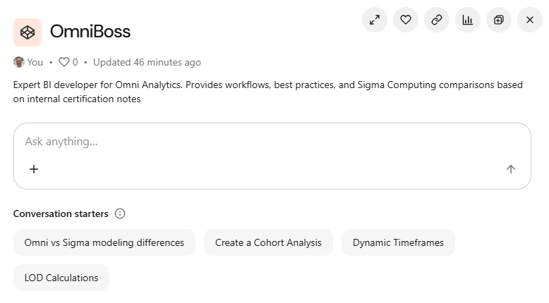

# OmniBoss – AI Knowledge Assistant for Omni Analytics

**Type:** Internal AI agent / knowledge tool  
**Tools:** Omni, Glean

## Overview

OmniBoss is an internal Glean AI agent that turns my Omni Analytics training documentation and certification notes into a virtual BI expert. It answers questions about modeling, cohort analysis, LOD strategies, and Omni vs Sigma trade-offs for project teams.

**Type:** Internal AI agent / knowledge tool  
**Tools:** Glean, LLM (ChatGPT), Omni, retrieval over internal docs, prompt chaining 

## Problem

Omni modeling patterns and best practices were scattered across personal notes, Notion pages, slide decks, and Slack threads.  

This caused:
- Repeated “how do I model this?” questions from new consultants  
- Ramp-up that depended on direct access to a few SMEs  
- Inconsistent answers to the same modeling and workflow questions  

## Solution

1. **Curated corpus**  
   - Collected Omni docs, internal training guides, and certification notes into a focused, agent-ready corpus.  

2. **Agent configuration**  
   - Designed a Glean agent (“OmniBoss”) scoped only to these sources to avoid hallucinations and keep answers grounded in approved patterns.  

3. **Prompt + response design**  
   - Wrote a system prompt and example Q&A so responses consistently return:  
     - A short summary  
     - A recommended modeling / dashboard pattern  
     - Links to deeper documentation or examples

## How it Works

- Consultants ask natural-language questions like:  
  - “How should I model a Topic in Omni?”  
  - “When should I use Topics vs Views?”  
  - “What’s our preferred pattern for Omni vs Sigma in this use case?”  
- OmniBoss retrieves relevant docs, applies the prompt logic, and returns a concise, contextual answer plus links to deeper material.  

## Impact

- Reduced repeated “how do I model this in Omni?” questions in Slack.  
- Faster ramp-up for new team members on Omni projects.  
- More consistent modeling and workflow decisions across consultants.  
- Created a reusable pattern for future agents (Sigma, dbt, etc.). 

*(Implementation details and metrics available on request; internal to employer.)*
